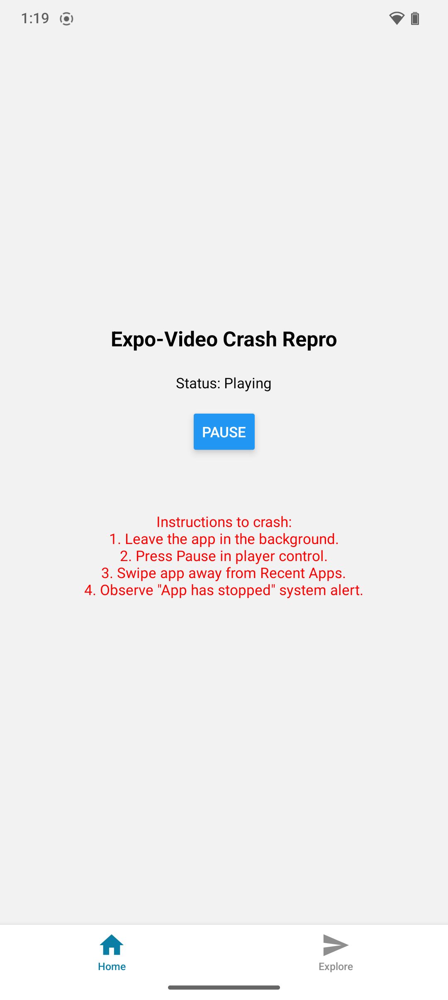
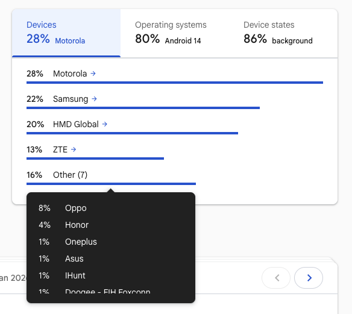

# [Expo-video][Android]: Crash on Swipe-to-Dismiss when player is paused

## Demo

## Description

When using expo-video on Android with background playback enabled, the app crashes with a java.lang.RuntimeException if the user swipes the app away (kills the task) while the player is in a paused state.

Interestingly, if the player is playing when the app is swiped away, the service either continues or shuts down cleanly. The crash only occurs specifically when the player is paused but the notification is still active. 

## Steps to Reproduce

1. Initialize a VideoPlayer with staysActiveInBackground: true and showNowPlayingNotification: true.

2. Start playback of an audio/video stream.

3. Pause the playback (notification remains visible).

4. Swipe the app away from the Android Recent Apps / Task Switcher.

5. An Android "App has stopped" alert appears immediately.

## Crash in Crashlytics

Fatal Exception: java.lang.RuntimeException
Unable to start service expo.modules.video.playbackService.ExpoVideoPlaybackService@632d492 with Intent { act=android.intent.action.MAIN cat=[android.intent.category.LAUNCHER] flg=0x10200000 cmp=com.eme.mediater/.MainActivity }: kotlin.UninitializedPropertyAccessException: lateinit property weakContext has not been initialized

android.app.ActivityThread.handleServiceArgs (ActivityThread.java:4840)
com.android.internal.os.ZygoteInit.main (ZygoteInit.java:977)
Caused by kotlin.UninitializedPropertyAccessException: lateinit property weakContext has not been initialized

## Environment

-> Expo SDK version: ~54.0.31
-> expo-video version: ~3.0.15
-> Android version: Android 14
-> Device: Nokia G60 5G

-> Other devices from crashlytyics:

-> Device without this crash: Samsung Galaxy S10 — Android 12
